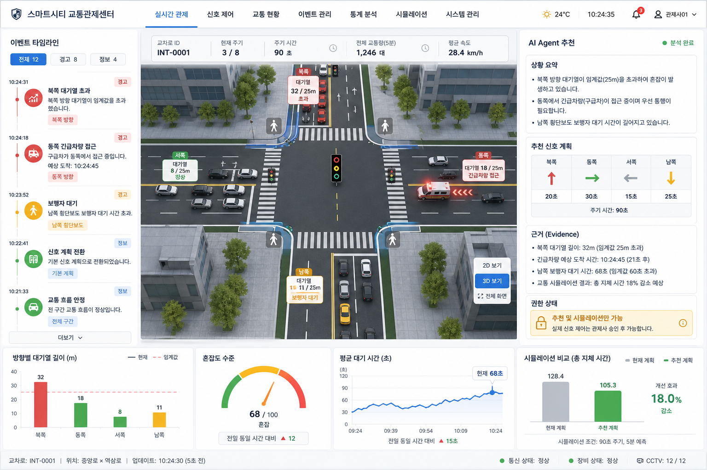

# 멀티모달 AI 기반 스마트 교차로 교통상황 분석 및 신호제어 의사결정 지원 대시보드 최종안

## 1. 프로젝트 개요

본 프로젝트는 스마트시티 교차로에서 발생하는 차량 흐름, 보행자 대기, 긴급차량 접근, 정체 및 위험 이벤트를 Vision AI와 생성형 AI로 분석하고, 웹 기반 디지털 트윈 대시보드에서 교통상황과 신호제어 추천안을 제공하는 8주 MVP 프로토타입이다.

초기 단계에서는 실제 도로 신호기, 실제 CCTV 스트리밍, 긴급차량 통신망과 직접 연동하지 않는다. 대신 샘플 영상, 이미지, 시뮬레이션 데이터, 가상 센서 데이터를 기반으로 교차로 상태를 분석하고, 분석 결과를 교통 이벤트로 저장한 뒤, LLM 기반 AI Agent가 현재 상황을 요약하고 신호 전환 또는 우선 제어 시나리오를 추천한다.

본 프로젝트의 핵심은 실제 제어 자동화가 아니라, 관제자가 교통상황을 빠르게 이해하고 의사결정을 검토할 수 있도록 지원하는 `공공 교통 관제용 AI 의사결정 지원 대시보드`를 구현하는 데 있다.

## 2. 결과물 제공 대상

### 2.1 주요 제공 대상

본 프로젝트의 결과물은 지자체 및 공공 교통 운영기관을 주요 제공 대상으로 한다.

| 구분 | 대상 |
|---|---|
| 1차 제공 대상 | 지자체 교통정보센터, 스마트시티 통합관제센터, 도로교통 관리부서 |
| 실제 사용자 | 교통 관제 요원, 교통 운영 담당자, 상황실 관리자 |
| 의사결정자 | 지자체 교통정책 담당자, 도로 운영 관리자, 공공 안전 담당자 |
| 평가 및 발표 대상 | 교수, 멘토, 프로젝트 심사위원, 공공 AI 서비스 평가자 |
| 간접 수혜자 | 운전자, 보행자, 긴급차량, 지역 시민 |

따라서 본 서비스는 일반 시민이 직접 사용하는 모바일 앱이 아니라, 관제자가 내부 업무에서 사용하는 웹 기반 관제 대시보드 형태로 제공된다.

### 2.2 제공 형태

최종 결과물은 다음과 같은 형태로 제공된다.

```text
- 웹 디지털 트윈 대시보드
- 교차로 영상/이미지 분석 데모
- 교통 이벤트 생성 및 관리 화면
- 신호제어 추천 및 시뮬레이션 화면
- 자연어 질의응답 화면
- 10분 단위 교통상황 리포트
- 시스템 아키텍처 및 데이터 구조 문서
- 최종 발표자료
```

## 3. 프로젝트 의의

### 3.1 공공 CCTV 영상분석 기술의 확장

기존 공공 CCTV 영상분석은 주로 객체 탐지, 이상행동 감지, 안전 모니터링에 집중되어 있다. 본 프로젝트는 이를 교차로 교통상황 분석으로 확장하여 차량 흐름, 보행자 요청, 긴급차량 접근, 교차로 내부 잔류 차량 등 교통 운영 관점의 이벤트로 변환한다.

즉, 단순히 화면에 객체를 표시하는 것이 아니라, 관제자가 바로 활용할 수 있는 `교통 이벤트`, `AI 요약`, `신호제어 추천안`으로 구조화한다는 점에서 의의가 있다.

### 3.2 관제 업무 부담 감소

교통 관제 담당자는 여러 CCTV 화면, 교통 이벤트, 신호 상태를 동시에 확인해야 한다. 본 프로젝트는 AI가 교차로 상황을 요약하고 위험 요인을 우선순위화하여 보여줌으로써 관제자의 실시간 확인 부담을 줄인다.

예를 들어, 관제자가 모든 영상을 직접 보는 대신 다음과 같은 요약을 즉시 확인할 수 있다.

```text
북쪽 방향 대기열이 기준치를 초과했고, 동쪽 방향에서 긴급차량 접근 이벤트가 발생했습니다.
우선 동쪽 방향 긴급차량 우선 신호를 적용하고, 이후 북남 방향 녹색 신호를 10초 연장하는 방안을 추천합니다.
```

### 3.3 멀티모달 AI 활용 검증

본 프로젝트는 Vision AI, VLM, LLM, RAG, AI Agent를 하나의 서비스 흐름으로 연결한다.

| AI 요소 | 프로젝트 내 역할 |
|---|---|
| Vision AI | 차량, 보행자, 신호등 등 객체 탐지 |
| VLM | 대표 프레임의 장면 설명 및 위험 상황 설명 |
| LLM | AI Agent의 추론 엔진으로 자연어 질의응답, 이벤트 요약, 리포트 생성 수행 |
| RAG | 이벤트 로그, 운영 기준 문서, 공공데이터 기반 근거 검색 |
| AI Agent | LLM에 도구 호출, 권한 정책, 추천 규칙을 결합한 업무 실행 계층 |

이 구조에서 LLM과 AI Agent는 별도 경쟁 요소가 아니라 통합되어 동작한다. LLM은 판단과 설명을 생성하는 모델이고, AI Agent는 LLM이 사용할 수 있는 데이터 조회, 이벤트 분석, 추천 규칙, 리포트 생성 도구와 권한 범위를 묶어 실제 관제 업무 흐름을 수행하게 하는 실행 구조이다. 따라서 본 프로젝트는 단일 AI 모델 데모가 아니라, 공공 서비스에서 AI를 실제 업무 흐름에 연결하는 형태를 보여준다.

### 3.4 안전한 신호제어 의사결정 지원

본 프로젝트는 실제 신호기를 자동으로 제어하지 않는다. 대신 `추천` 또는 `시뮬레이션 적용` 형태로 결과를 제공한다. 이 방식은 8주 프로젝트 범위에서 현실적이며, 실제 도로 안전 문제를 피하면서도 AI 기반 신호제어 의사결정 가능성을 검증할 수 있다.

### 3.5 향후 확장 가능성

MVP 이후에는 다음 방향으로 확장할 수 있다.

```text
- 실제 CCTV 스트리밍 연동
- 실제 신호제어기 또는 교통 시뮬레이터 연동
- 긴급차량 위치 데이터 연동
- 교통사고 및 이상정지 이벤트 고도화
- 공공데이터 기반 시간대별 교통 패턴 분석
- 일일/주간 자동 리포트 생성
- 지자체 관제센터용 SaaS 또는 내부망 시스템 확장
```

## 4. 프로젝트 목표

교차로 영상 또는 시뮬레이션 데이터를 AI가 분석하여 차량, 보행자, 긴급차량, 정체 상황을 감지하고, 사용자가 웹 대시보드와 자연어 질의를 통해 현재 교통상황과 추천 조치를 확인할 수 있는 프로토타입을 구현한다.

핵심 검증 흐름은 다음과 같다.

```text
샘플 영상 / 이미지 / 시뮬레이션 데이터
-> YOLO 기반 객체 탐지
-> 방향별 차량 수, 대기열, 보행자 상태 계산
-> 교통 이벤트 생성 및 저장
-> VLM / LLM 기반 상황 요약
-> RAG 기반 근거 검색
-> AI Agent 기반 신호제어 추천
-> Next.js 디지털 트윈 대시보드 표시
```

## 5. 서비스 사용 시나리오

### 5.1 관제자 시나리오

1. 관제자가 웹 대시보드에 접속한다.
2. 교차로 디지털 트윈 화면에서 현재 방향별 차량 대기열과 신호 상태를 확인한다.
3. 시스템이 샘플 영상 또는 시뮬레이션 데이터를 분석해 이벤트를 생성한다.
4. 대시보드에 `북쪽 방향 대기열 초과`, `동쪽 방향 긴급차량 접근`, `보행자 대기` 등의 이벤트가 표시된다.
5. AI 요약 카드가 현재 위험 요인을 간단히 설명한다.
6. AI Agent가 다음 신호 주기에 대한 추천안을 제시한다.
7. 관제자는 추천안을 검토하고 시뮬레이션 적용 결과를 확인한다.
8. 필요 시 자연어로 질문하고 10분 단위 리포트를 생성한다.

### 5.2 자연어 질의 예시

```text
- 현재 가장 혼잡한 방향은 어디야?
- 긴급차량 우선 신호가 필요한 상황이야?
- 지난 10분 동안 위험 이벤트를 요약해줘.
- 현재 신호제어 추천 이유를 설명해줘.
- 고정 신호 방식과 비교했을 때 어떤 개선이 있었어?
```

### 5.3 AI Agent 업무 시나리오

AI Agent는 관제자를 대신해 실제 신호기를 제어하지 않는다. 대신 관제자가 검토할 수 있는 분석, 추천, 설명, 리포트 생성 업무를 수행한다.

| 시나리오 | 입력 | Agent 처리 | 출력 |
|---|---|---|---|
| 혼잡 방향 판단 | 최근 이벤트, 방향별 대기열, 현재 신호 상태 | 가장 혼잡한 방향과 원인을 분석 | `북쪽 방향 대기열 초과, 녹색 10초 연장 추천` |
| 긴급차량 우선 추천 | 긴급차량 이벤트, 접근 방향, 현재 신호 | 긴급차량 방향 우선 신호 필요 여부 판단 | `동쪽 방향 우선 신호 시뮬레이션 적용 권장` |
| 보행자 대기 대응 | 보행자 감지, 대기 시간, 차량 흐름 | 보행자 신호 삽입 가능성 검토 | `다음 주기 보행자 횡단 신호 삽입 추천` |
| 위험 이벤트 설명 | 교차로 내부 잔류, 정체, 대표 프레임 설명 | 위험 요인과 추천 조치 요약 | `교차로 중앙 잔류 차량으로 전체 적색 단계 권장` |
| 관제 리포트 생성 | 10분 이벤트 로그, 추천 이력, 처리 상태 | 주요 이벤트와 대응 결과 요약 | `10분 단위 상황 리포트 생성` |

## 6. 확정 모델 구성

본 최종안은 2026년 6월 1일 기준으로 확인한 공식 문서와 현재까지 논의한 가성비 조건을 반영한다.

### 6.1 객체 탐지 모델

| 용도 | 모델 | 사용 이유 |
|---|---|---|
| 기본 차량/보행자/신호등 탐지 | `yolo26s.pt` | 속도와 정확도의 균형이 좋아 MVP 기본 모델로 적합 |
| 저사양 또는 CPU fallback | `yolo26n.pt` | 가장 가벼운 모델로 빠른 테스트와 저비용 실행에 적합 |
| 정확도 우선 옵션 | `yolo26m.pt` | GPU 사용 시 탐지 정확도를 높이고 싶을 때 선택 |

기본 운영 모델은 `yolo26s.pt`로 지정한다. 개발 초기와 빠른 테스트에는 `yolo26n.pt`를 사용하고, 정확도 향상이 필요할 때만 `yolo26m.pt`를 사용한다.

주의할 점은 기본 YOLO 모델이 `car`, `bus`, `truck`, `person`, `traffic light` 같은 일반 객체 탐지에는 적합하지만, `ambulance`, `fire truck`, `police car` 같은 긴급차량 세부 분류를 항상 정확히 구분하지는 않는다는 점이다. MVP에서는 긴급차량 이벤트를 시뮬레이션 데이터로 처리하고, 고도화 단계에서 커스텀 데이터셋 fine-tuning을 고려한다.

### 6.2 LLM / VLM / AI Agent 구성

| 용도 | 모델 | 사용 이유 |
|---|---|---|
| 자연어 질의응답 | `gpt-5.4-mini` | 비용과 성능 균형이 좋고 이미지 입력도 지원 |
| 대표 프레임 장면 설명 | `gpt-5.4-mini` | VLM 역할로 교차로 상황을 자연어 설명 |
| 이벤트 요약 / 리포트 생성 | `gpt-5.4-mini` | 반복 호출이 필요한 MVP에 적합 |
| AI Agent 추론 엔진 | `gpt-5.4-mini` | 이벤트 조회, RAG 검색, 추천 규칙 호출 결과를 통합해 관제자용 답변 생성 |
| 최종 발표용 고품질 문장 개선 | `gpt-5.5` 선택 사용 | 복잡한 추론 또는 최종 보고서 품질 개선용 |

OpenAI 공식 모델 문서 기준 최신 모델은 텍스트와 이미지 입력을 지원하며, 비용과 지연시간을 최적화할 경우 `gpt-5.4-mini` 또는 `gpt-5.4-nano` 같은 작은 모델을 선택할 수 있다. 본 프로젝트는 이미지 설명, 질의응답, 리포트 생성이 필요하므로 `gpt-5.4-mini`를 기본 모델로 사용한다.

VLM은 차량 수 계산이나 정확한 위치 측정에 사용하지 않는다. 정량 정보는 YOLO가 담당하고, VLM은 장면 설명과 위험 요약에 사용한다.

AI Agent는 별도의 독립 모델이 아니라 `gpt-5.4-mini`를 추론 엔진으로 사용하는 업무 실행 계층이다. Agent는 다음 도구를 호출할 수 있다.

```text
- get_intersection_status: 현재 신호 상태와 방향별 대기열 조회
- get_recent_events: 최근 교통 이벤트 조회
- search_policy_docs: 운영 기준 및 이벤트 로그 RAG 검색
- recommend_signal_plan: 규칙 기반 신호제어 추천안 생성
- simulate_signal_plan: 추천안을 가상 상태에만 적용해 효과 예측
- generate_report: 10분 단위 상황 리포트 생성
```

### 6.3 임베딩 모델

| 용도 | 모델 | 사용 이유 |
|---|---|---|
| RAG 문서 검색 | `text-embedding-3-small` | 비용이 낮고 이벤트 로그/운영 기준 검색에 충분 |

`text-embedding-3-small`은 이벤트 로그, 운영 기준 문서, 공공데이터 요약문, 리포트 결과를 벡터화하는 데 사용한다.

## 7. 전체 기술스택

| 영역 | 기술스택 | 역할 |
|---|---|---|
| Frontend | Next.js, React, TypeScript | 웹 대시보드, 디지털 트윈 UI, 채팅 UI 구현 |
| UI | Tailwind CSS, shadcn/ui 또는 MUI | 카드, 테이블, 패널, 모달 등 대시보드 구성 |
| Chart | Recharts 또는 ECharts | 혼잡도, 대기열, 평균 대기시간 시각화 |
| Digital Twin | SVG, Canvas, Konva.js 중 선택 | 교차로, 신호등, 차량 흐름 표시 |
| Traffic Simulation | SUMO, TraCI, Python | 실제 테스트를 대체하는 교통 흐름 및 신호제어 시뮬레이션 |
| 3D Visualization | Unity 선택 사용 | 발표용 3D 교차로, 가상 CCTV 화면, 시각적 데모 생성 |
| Backend | FastAPI | API 서버, 파일 업로드, 분석 요청, 추천 요청 처리 |
| Realtime | FastAPI WebSocket | 이벤트 발생 시 대시보드 실시간 갱신 |
| Vision AI | OpenCV, Ultralytics YOLO | 영상 프레임 추출, 객체 탐지, 분석 결과 생성 |
| LLM/VLM/AI Agent | OpenAI API | 장면 설명, 질의응답, 요약, 리포트 생성, Agent 추천 생성 |
| Database | PostgreSQL | 이벤트 로그, 분석 결과, 신호 상태 저장 |
| Vector DB | pgvector | RAG 검색용 벡터 저장 |
| Object Storage | Cloudflare R2 | 영상, 이미지, 분석 결과 파일 저장 |
| Deployment | Docker Compose | 앱 서버, 백엔드, DB 실행환경 통합 |
| GPU Runtime | RunPod GPU Pod | YOLO 추론 및 필요 시 fine-tuning |

## 8. 시스템 아키텍처

```text
사용자 / 관제자
    |
    v
Next.js 디지털 트윈 대시보드
    |
    v
FastAPI Backend
    |
    +--> SUMO / TraCI 교통 시뮬레이션
    +--> Unity 3D 교차로 시각화 또는 가상 CCTV 생성
    +--> OpenCV 프레임 추출
    +--> YOLO26 객체 탐지
    +--> 교통 이벤트 생성
    +--> PostgreSQL 이벤트 저장
    +--> pgvector 기반 RAG 검색
    +--> gpt-5.4-mini 질의응답 / 요약 / 리포트
    +--> AI Agent 신호제어 추천
    |
    v
WebSocket 실시간 이벤트 알림
```

### 8.1 UI/UX 최종 서비스 화면 구성

최종 서비스는 관제자가 한 화면에서 교차로 상태, 이벤트, AI 추천, 시뮬레이션 결과를 동시에 확인하는 관제 대시보드로 구성한다.

| 화면 영역 | 주요 구성 | UX 목적 |
|---|---|---|
| 상단 상태 바 | 교차로명, 현재 시각, 분석 상태, 연결 상태 | 현재 시스템이 정상 동작 중인지 즉시 확인 |
| 중앙 디지털 트윈 | 사거리 도로, 방향별 차량 흐름, 신호등, 보행자 대기, 긴급차량 경로 | 실제 CCTV를 계속 보지 않아도 교차로 상태를 직관적으로 파악 |
| 좌측 이벤트 타임라인 | 대기열 초과, 보행자 대기, 긴급차량 접근, 교차로 잔류 이벤트 | 최근 발생 이벤트와 심각도를 시간순으로 확인 |
| 우측 AI Agent 패널 | 현재 상황 요약, 추천 신호안, 추천 근거, 권한 상태 | AI가 무엇을 근거로 어떤 조치를 제안하는지 검토 |
| 하단 지표 패널 | 방향별 대기열, 평균 대기시간, 혼잡도, 추천 적용 전후 비교 | 추천안의 기대 효과를 수치로 확인 |
| 채팅/리포트 패널 | 자연어 질문, 답변, 10분 리포트 생성 버튼 | 관제자가 추가 질문과 보고서 생성을 한 화면에서 수행 |

### 8.2 UX 흐름

```text
1. 관제자가 대시보드에 접속한다.
2. 중앙 디지털 트윈에서 현재 교차로 상태를 확인한다.
3. 이벤트 타임라인에서 심각도가 높은 이벤트를 선택한다.
4. AI Agent 패널에서 추천안과 추천 근거를 확인한다.
5. 관제자가 `시뮬레이션 적용`을 눌러 가상 결과를 확인한다.
6. 실제 제어가 필요한 경우에는 관제자가 별도 교통 운영 절차에 따라 판단한다.
7. 상황 종료 후 10분 리포트를 생성해 발표 또는 운영 기록으로 활용한다.
```

### 8.3 GPT 이미지 생성용 예상 화면 프롬프트

최종 발표자료에는 다음과 같은 UI 예상 화면을 포함한다.



이미지 생성에는 다음 프롬프트를 사용한다.

```text
Create a high-fidelity web dashboard mockup for a Korean smart city traffic control center.
The screen shows a public traffic operations dashboard for a four-way intersection.
Center: clean digital twin map of an intersection with lanes, traffic lights, vehicle queues by direction, pedestrian waiting icons, and an emergency vehicle approaching from the east.
Left panel: event timeline with Korean labels such as "북쪽 대기열 초과", "동쪽 긴급차량 접근", "보행자 대기".
Right panel: AI Agent recommendation card with Korean text, showing situation summary, recommended signal plan, evidence, and permission status "추천 및 시뮬레이션만 가능".
Bottom panel: compact charts for queue length, congestion level, average waiting time, and before/after simulation comparison.
Style: professional government operations dashboard, realistic SaaS UI, clear hierarchy, dark text on light background, restrained blue/green/red status colors, no decorative gradients, no marketing hero layout.
Aspect ratio 16:9, desktop dashboard screenshot, sharp readable UI, suitable for a final project presentation.
```

## 9. 구현 방법

### 9.1 데이터 입력

초기 MVP에서는 실제 CCTV 스트리밍을 연결하지 않고 다음 입력을 사용한다.

| 입력 데이터 | 구현 방법 |
|---|---|
| 교차로 이미지 | 사용자가 업로드하거나 샘플 파일로 제공 |
| 짧은 교차로 영상 | OpenCV로 1초당 1프레임 추출 |
| SUMO 시뮬레이션 데이터 | 방향별 차량 수, 대기열, 신호 상태, 통과량을 TraCI로 조회 |
| Unity 가상 CCTV | 3D 교차로 장면을 카메라 시점으로 렌더링해 영상/이미지 데모 생성 |
| 긴급차량 이벤트 | SUMO 또는 JSON 시나리오에서 긴급차량 접근 이벤트로 생성 |

영상 전체를 매 프레임 분석하지 않고, 1초당 1프레임 또는 이벤트 구간만 분석하여 비용과 처리 시간을 줄인다.

### 9.2 Vision AI 분석

```text
1. 이미지 또는 영상 업로드
2. OpenCV로 프레임 추출
3. YOLO26 모델로 차량/보행자/신호등 탐지
4. 탐지 결과를 방향별로 집계
5. 대기열, 혼잡도, 보행자 요청 상태 계산
6. 규칙 기반 교통 이벤트 생성
7. 필요 시 대표 프레임을 VLM에 전달해 장면 설명 생성
```

분석 결과 예시는 다음과 같다.

```json
{
  "north_queue": 12,
  "south_queue": 5,
  "east_queue": 3,
  "west_queue": 8,
  "pedestrian_waiting": true,
  "emergency_vehicle": true,
  "congestion_level": "high",
  "summary": "북쪽 방향 대기열이 길고 동쪽에서 긴급차량 접근 이벤트가 발생했습니다."
}
```

### 9.3 이벤트 생성

| 이벤트 유형 | 생성 조건 |
|---|---|
| 대기열 초과 | 특정 방향 차량 수가 기준값 초과 |
| 보행자 대기 | 횡단보도 앞 보행자 감지 또는 시뮬레이션 요청 발생 |
| 긴급차량 접근 | 긴급차량 시뮬레이션 이벤트 또는 VLM 보조 판단 |
| 교차로 내부 잔류 | 교차로 중앙 영역에 차량이 일정 시간 이상 감지 |
| 신호 전환 효과 미흡 | 신호 변경 후 대기열 감소폭이 기준 미달 |

저장 항목은 다음과 같다.

```text
- 이벤트 ID
- 발생 시각
- 발생 방향
- 이벤트 유형
- 심각도
- 관련 객체 수
- AI 분석 요약
- 추천 조치
- 처리 상태
```

### 9.4 신호제어 추천

초기 버전에서는 강화학습이나 실제 신호제어 알고리즘을 사용하지 않고, 규칙 기반 추천 로직을 사용한다.

```text
if emergency_vehicle == true:
    recommend = "긴급차량 방향 우선 신호 적용"
elif north_queue > threshold:
    recommend = "북남 방향 녹색 신호 10초 연장"
elif pedestrian_waiting_time > threshold:
    recommend = "보행자 횡단 신호 삽입"
elif intersection_blocked == true:
    recommend = "전체 적색 안전 단계 적용"
else:
    recommend = "기본 신호 주기 유지"
```

추천 결과는 실제 제어 명령이 아니라 `추천안` 또는 `시뮬레이션 적용`으로 표시한다.

### 9.5 자연어 질의응답

```text
사용자 질문
-> 최근 이벤트 로그 검색
-> pgvector로 관련 문서/이벤트 검색
-> gpt-5.4-mini에 컨텍스트 전달
-> 답변 생성
-> 대시보드 채팅창에 표시
```

### 9.6 리포트 생성

리포트는 10분 단위 또는 데모 시나리오 단위로 생성한다.

포함 항목은 다음과 같다.

```text
- 기간별 교통상황 요약
- 방향별 평균 대기열 변화
- 긴급차량 이벤트 처리 이력
- 보행자 요청 처리 현황
- 주요 위험 이벤트
- 신호제어 추천 내역
- 고정 신호 대비 개선 가능성
```

### 9.7 AI Agent 구현 방식과 권한 범위

AI Agent는 FastAPI 백엔드 내부의 `agent_service` 모듈로 구현한다. 프론트엔드는 `/api/chat`, `/api/recommend-signal`, `/api/report`를 호출하고, 백엔드는 현재 교차로 상태와 이벤트 로그를 조회한 뒤 LLM에 필요한 컨텍스트와 호출 가능한 도구 목록을 전달한다.

```text
사용자 요청 또는 이벤트 발생
-> FastAPI agent_service
-> 현재 교차로 상태 조회
-> 최근 이벤트 및 RAG 근거 검색
-> 규칙 기반 추천 함수 호출
-> gpt-5.4-mini가 요약, 근거, 추천안 생성
-> 대시보드에 추천 및 시뮬레이션 결과 표시
```

Agent 권한은 다음처럼 제한한다.

| 권한 구분 | 허용 여부 | 설명 |
|---|---|---|
| 교차로 상태 조회 | 허용 | 현재 신호, 방향별 대기열, 보행자 요청 조회 |
| 이벤트 로그 조회 | 허용 | 최근 이벤트와 심각도 확인 |
| 운영 기준 문서 검색 | 허용 | RAG로 추천 근거 검색 |
| 추천안 생성 | 허용 | 신호 연장, 보행자 신호 삽입, 전체 적색 단계 등 추천 |
| 시뮬레이션 적용 | 허용 | 실제 제어가 아닌 가상 상태에서만 효과 예측 |
| 리포트 생성 | 허용 | 10분 단위 상황 요약 생성 |
| 실제 신호기 제어 | 금지 | MVP에서는 외부 신호제어기와 직접 연결하지 않음 |
| DB 원본 삭제/수정 | 금지 | 이벤트 처리 상태 변경 외 원본 로그 삭제 금지 |
| 외부 기관 시스템 호출 | 금지 | 긴급차량망, 실제 교통 운영망, 행정망 호출 금지 |

Agent 응답은 반드시 `현재 상황`, `추천 조치`, `추천 근거`, `권한 한계`, `시뮬레이션 결과`를 분리해 표시한다. 이를 통해 사용자는 AI가 실제 제어 명령을 내리는 것이 아니라, 검토 가능한 의사결정 지원 정보를 제공한다는 점을 명확히 이해할 수 있다.

### 9.8 SUMO와 Unity 기반 시뮬레이션 전략

실제 교차로, 실제 신호기, 실제 CCTV를 연결해 테스트하는 것은 8주 MVP 범위와 안전 조건상 어렵다. 따라서 실제 현장 테스트는 하지 않고, 교통 흐름 검증과 발표용 시각화를 분리해 시뮬레이션한다.

핵심 판단은 다음과 같다.

| 도구 | 적합한 역할 | 본 프로젝트 적용 |
|---|---|---|
| SUMO | 차량 흐름, 대기열, 신호 주기, 통과량, 평균 대기시간 검증 | 핵심 교통 시뮬레이션 엔진으로 사용 |
| TraCI | 실행 중인 SUMO 시뮬레이션 상태 조회 및 신호 단계 제어 | Python에서 FastAPI와 연결해 추천안 적용 전후 비교 |
| Unity | 3D 교차로 시각화, 가상 CCTV 영상, 발표용 데모 화면 | 선택 구현 또는 발표 강화 요소로 사용 |
| CARLA | 자율주행 센서, 라이다, 차량 주행 시나리오 | 8주 MVP에는 과하므로 제외 |

Unity는 시각적으로 설득력 있는 3D 장면과 가상 CCTV 영상을 만들기 좋지만, 교통 신호 운영 성능을 검증하는 전용 도구는 아니다. 반면 SUMO는 교통 흐름과 신호제어 시뮬레이션에 특화되어 있고 TraCI를 통해 외부 Python 코드가 시뮬레이션 상태를 읽고 신호 단계를 변경할 수 있다. 따라서 본 프로젝트는 `SUMO로 교통 타당성을 검증하고, Unity로 시각적 데모를 보강하는 하이브리드 방식`을 권장한다.

구현 흐름은 다음과 같다.

```text
SUMO 교차로 네트워크 생성
-> 차량 흐름, 보행자 요청, 긴급차량 시나리오 설정
-> Python TraCI로 방향별 대기열, 평균 대기시간, 통과량 조회
-> FastAPI가 시뮬레이션 상태를 이벤트 JSON으로 변환
-> AI Agent가 추천 신호안을 생성
-> TraCI로 추천 신호안을 가상 적용
-> 고정 신호 대비 추천 신호의 개선 지표 계산
-> Next.js 대시보드에 시뮬레이션 결과 표시
-> 필요 시 Unity에서 동일 시나리오를 3D 장면 또는 가상 CCTV 영상으로 시각화
```

시뮬레이션 검증 지표는 다음과 같이 설정한다.

```text
- 방향별 평균 대기열 길이
- 방향별 평균 대기시간
- 전체 차량 통과량
- 긴급차량 예상 통과 시간
- 보행자 최대 대기시간
- 교차로 내부 잔류 이벤트 수
- 고정 신호 대비 추천 신호 적용 후 평균 지체시간 개선율
```

MVP에서는 Unity에서 정교한 교통 물리 모델을 직접 구현하지 않는다. Unity는 `보여주는 화면`, SUMO는 `검증하는 시뮬레이션 엔진`으로 역할을 나눈다. 이 방식이 개발 난이도, 발표 설득력, 교통 시뮬레이션 타당성 사이의 균형이 가장 좋다.

## 10. API 및 데이터 구조

### 10.1 주요 API

```text
POST /api/upload
POST /api/analyze
GET  /api/events
GET  /api/intersection/status
POST /api/recommend-signal
POST /api/chat
POST /api/report
WS   /ws/events
```

### 10.2 주요 테이블

```text
traffic_events
- id
- timestamp
- direction
- event_type
- severity
- object_count
- ai_summary
- recommendation
- status

intersection_status
- id
- signal_phase
- north_queue
- south_queue
- east_queue
- west_queue
- pedestrian_request
- emergency_priority

chat_logs
- id
- question
- answer
- referenced_event_ids

reports
- id
- period_start
- period_end
- summary
- generated_at
```

## 11. 클라우드 리소스 구성

### 11.1 가성비 운영 구성

| 리소스 | 추천 구성 | 역할 |
|---|---|---|
| 앱 서버 | AWS Lightsail 4GB Linux | Next.js, FastAPI, PostgreSQL 실행 |
| GPU 서버 | RunPod RTX A5000 24GB | YOLO 추론, 샘플 영상 분석, 소규모 학습 |
| 객체 저장소 | Cloudflare R2 | 영상/이미지/분석 결과 파일 저장 |
| LLM/VLM/AI Agent | OpenAI API | 장면 설명, 질의응답, 리포트 생성, Agent 추천 생성 |
| DB | PostgreSQL + pgvector | 이벤트 로그, 상태, 벡터 검색 저장 |

가성비 운영의 핵심은 GPU 서버를 상시 운영하지 않는 것이다. 앱 서버와 DB는 저렴한 CPU 서버에서 계속 운영하고, GPU 서버는 영상 분석이나 모델 테스트가 필요할 때만 켠다.

### 11.2 물리적 리소스 요구사항

| 구분 | 최소 | 권장 |
|---|---|---|
| 앱 서버 CPU | 2 vCPU | 2~4 vCPU |
| 앱 서버 RAM | 2GB | 4GB 이상 |
| 앱 서버 Disk | 40GB | 80GB 이상 |
| GPU VRAM | 8GB 이상 | 24GB |
| GPU RAM | 16GB 이상 | 25GB 이상 |
| 객체 저장소 | 10GB | 50~100GB |
| DB 저장공간 | 5GB | 20GB 이상 |

## 12. 예상 비용 산출

기준은 8주, 약 2개월 운영이며 환율은 계산 편의상 `$1 = 1,500원`으로 적용한다. 부가세, 카드 수수료, 환율 변동은 제외한다.

### 12.1 기본 가성비 예산안

| 항목 | 계산식 | 예상 비용 |
|---|---:|---:|
| 앱/DB 서버 | AWS Lightsail 4GB, $24/mo x 2개월 | $48 / 약 72,000원 |
| GPU 사용료 | RunPod RTX A5000, $0.27/h x 150시간 | $40.5 / 약 60,750원 |
| GPU 저장공간 | 50GB x $0.07/GB/mo x 2개월 | $7 / 약 10,500원 |
| 객체 저장소 | Cloudflare R2 50GB 내외 | 약 $1~2 / 약 3,000원 이하 |
| OpenAI API | `gpt-5.4-mini` 중심 사용 | $20~50 / 약 30,000~75,000원 |
| 임베딩 | `text-embedding-3-small`, 1천만 토큰 내외 | $1 이하 / 약 1,500원 이하 |
| 예비비 | 재실행, 트래픽, 설정 실수 대비 | 약 30,000~50,000원 |
| 합계 |  | 약 22만~27만 원 |

권장 확보 예산은 30만 원이다.

### 12.2 GPU 사용 시간별 비용

| GPU 사용 시간 | RunPod RTX A5000 기준 | 원화 환산 |
|---:|---:|---:|
| 50시간 | $13.5 | 약 20,250원 |
| 150시간 | $40.5 | 약 60,750원 |
| 300시간 | $81 | 약 121,500원 |
| 1,344시간, 8주 상시 | $362.88 | 약 544,320원 |

GPU를 8주 동안 상시 켜두면 GPU 비용만 약 54만 원 이상 발생한다. 따라서 가성비 프로젝트에서는 GPU를 작업할 때만 켜야 한다.

### 12.3 모델 사용 비용 관리

```text
1. 대표 프레임에만 VLM 호출
2. 모든 프레임 설명 생성 금지
3. 이벤트 로그 요약은 짧은 컨텍스트로 전달
4. 반복 테스트는 샘플 데이터를 캐싱
5. gpt-5.5는 최종 리포트 품질 개선용으로만 제한 사용
```

## 13. 8주 구현 일정

| 주차 | 구현 목표 |
|---|---|
| 1주차 | 요구사항 정리, 화면 설계, 데이터 구조 정의 |
| 2주차 | Next.js 대시보드 기본 UI 구현 |
| 3주차 | FastAPI API 서버, PostgreSQL, pgvector 연결 |
| 4주차 | 이미지/영상 업로드, OpenCV 프레임 추출, YOLO 분석 연결 |
| 5주차 | SUMO/TraCI 시뮬레이션 연동, 이벤트 생성 로직, 혼잡도 계산 구현 |
| 6주차 | 신호제어 추천 로직, 고정 신호 대비 추천 신호 시뮬레이션 비교 구현 |
| 7주차 | 자연어 질의응답, RAG 검색, 10분 리포트 생성 구현 |
| 8주차 | 통합 테스트, 비용 점검, Unity 선택 시각화, 발표자료, 데모 시나리오 정리 |

## 14. MVP 범위와 제외 범위

### 14.1 반드시 구현할 범위

```text
- 웹 디지털 트윈 대시보드
- 샘플 이미지/영상 분석 결과 표시
- YOLO 기반 차량/보행자 탐지
- 방향별 대기열 및 혼잡도 계산
- SUMO 기반 교통 흐름 시뮬레이션
- TraCI 기반 추천 신호안 적용 전후 비교
- 교통 이벤트 생성 및 저장
- 신호제어 추천안 표시
- 자연어 질의응답
- 10분 단위 리포트 생성
```

### 14.2 선택 구현 범위

```text
- WebSocket 실시간 알림
- RAG 기반 운영 기준 검색
- VLM 기반 대표 프레임 장면 설명
- 긴급차량 커스텀 분류
- 발표용 분석 결과 이미지 저장
- Unity 기반 3D 교차로 시각화 또는 가상 CCTV 영상 생성
```

### 14.3 제외 권장 범위

```text
- 실제 신호기 제어
- 실제 CCTV 스트리밍 상시 연동
- 실제 긴급차량 위치 데이터 연동
- 강화학습 기반 신호제어
- 대규모 커스텀 모델 학습
- Unity 내부에서 정교한 교통 물리/신호 최적화 엔진을 직접 구현
- CARLA 기반 자율주행 센서 시뮬레이션
```

## 15. 리스크와 대응 방안

| 리스크 | 대응 방안 |
|---|---|
| YOLO가 긴급차량을 정확히 구분하지 못함 | MVP에서는 시뮬레이션 이벤트로 처리하고, 고도화 시 커스텀 학습 |
| GPU 비용 증가 | GPU 서버를 필요할 때만 켜고, 분석 결과를 캐싱 |
| VLM 비용 증가 | 모든 프레임이 아니라 대표 프레임만 호출 |
| 앱 서버 메모리 부족 | 4GB 이상 서버로 시작하고, 필요 시 8GB로 증설 |
| 실제 교통 제어로 오해될 가능성 | UI에 `추천` 및 `시뮬레이션 적용`으로 명확히 표기 |
| 영상 분석 시간이 길어짐 | 1초당 1프레임 또는 이벤트 구간만 분석 |
| Unity 구현 범위가 커짐 | Unity는 발표용 시각화로 제한하고 교통 검증은 SUMO가 담당 |
| SUMO 연동 난이도 | 단일 사거리 네트워크와 고정 시나리오부터 구현하고 TraCI 조회 항목을 대기열/대기시간/통과량으로 제한 |

## 16. 최종 산출물

```text
- 프로젝트 기획서
- 기능 정의서
- 기술스택 및 모델 선정 문서
- 클라우드 리소스 및 비용 산출 문서
- 웹 디지털 트윈 대시보드 UI 프로토타입
- SUMO 기반 교통 흐름 시뮬레이션 데모
- 고정 신호 대비 AI 추천 신호 비교 결과
- 교차로 영상/이미지 분석 데모
- 교통 이벤트 생성 데모
- 자연어 질의응답 데모
- 신호제어 추천 및 시뮬레이션 화면
- AI 요약 및 10분 리포트 예시
- 시스템 아키텍처 설계안
- 데이터 구조 설계안
- 최종 발표자료
```

## 17. 최종 권장안

본 프로젝트의 최종 권장 구성은 다음과 같다.

```text
제공 대상: 지자체 교통정보센터 / 스마트시티 통합관제센터 / 도로교통 관리부서
서비스 형태: 공공 교통 관제용 AI 의사결정 지원 대시보드
Object Detection: yolo26s.pt
CPU fallback: yolo26n.pt
Accuracy option: yolo26m.pt
LLM / VLM 기본 모델: gpt-5.4-mini
AI Agent 구현: gpt-5.4-mini + FastAPI agent_service + 제한 권한 도구 호출
고품질 리포트 옵션: gpt-5.5
Embedding: text-embedding-3-small
Frontend: Next.js + React + TypeScript
Backend: FastAPI
Traffic Simulation: SUMO + TraCI + Python
3D Visualization: Unity 선택 사용
Database: PostgreSQL + pgvector
Object Storage: Cloudflare R2
GPU Cloud: RunPod RTX A5000
App Server: AWS Lightsail 4GB Linux
Deployment: Docker Compose
권장 예산: 30만 원
```

본 프로젝트는 공공 CCTV 영상분석, 교통 이벤트 관리, 자연어 질의응답, AI 기반 신호제어 추천을 하나의 서비스 흐름으로 연결한다. 8주 MVP 범위에서는 실제 교통 인프라 제어보다 `분석`, `시각화`, `요약`, `추천`, `시뮬레이션`에 집중하는 것이 가장 현실적이며, 발표 및 평가에서도 완성도를 보여주기 쉽다.

실제 테스트가 불가능한 조건에서는 Unity만으로 전체 시뮬레이션을 구현하기보다 `SUMO + TraCI`를 교통 흐름 검증 엔진으로 사용하고, Unity는 선택적으로 3D 교차로 시각화와 가상 CCTV 생성에 활용하는 구성이 가장 적합하다. 이 방식은 교통 시뮬레이션의 타당성과 발표 시각화 효과를 동시에 확보할 수 있다.

## 18. 참고 자료

- OpenAI Models: https://developers.openai.com/api/docs/models
- OpenAI GPT-5.4 mini: https://developers.openai.com/api/docs/models/gpt-5.4-mini
- OpenAI text-embedding-3-small: https://developers.openai.com/api/docs/models/text-embedding-3-small
- OpenAI API Pricing: https://openai.com/api/pricing/
- Ultralytics YOLO26: https://docs.ultralytics.com/models/yolo26/
- AWS Lightsail Pricing: https://aws.amazon.com/lightsail/pricing/
- RunPod Pricing: https://www.runpod.io/pricing/
- RunPod Network Volumes: https://docs.runpod.io/pods/storage/create-network-volumes
- Cloudflare R2 Pricing: https://developers.cloudflare.com/r2/pricing/
- Eclipse SUMO: https://eclipse.dev/sumo/
- SUMO Traffic Lights: https://eclipse.dev/sumo/docs/Simulation/Traffic_Lights.html
- SUMO TraCI: https://eclipse.dev/sumo/docs/TraCI/index.html
- Unity Perception: https://github.com/Unity-Technologies/com.unity.perception
- CARLA Simulator: https://carla.org/
