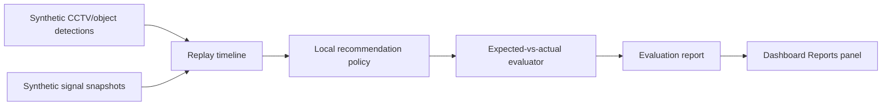

# Synthetic Evaluation Demo Flow

## Purpose

This document explains the current demo direction for presentation use.

For the exact rehearsal sequence, operator clicks, expected results, and
recovery notes, use `docs/presentation/final-demo-runbook.md`.

The core message is:

> Before live CCTV and signal integration, the system generates realistic
> detection/signal datasets, replays them like live inputs, runs local
> recommendation evaluation, and shows measurable pass/fail evidence on the
> dashboard.

Do not present the current system as live CCTV monitoring, production signal
control, or a deployed traffic controller. Present it as a local decision-support
and evaluation prototype.

## What Changed From The Earlier Demo

Earlier message:

- The dashboard showed trusted-looking fixture data and a recommendation.
- The presentation risk was that it looked like a static dashboard with little
  proof that the recommendation pipeline was testable.

Current message:

- The project now has a local synthetic evaluation loop.
- The dashboard can show that 100 generated cases were evaluated.
- Each case belongs to one of the presentation scenario families:
  emergency, pedestrian, blocked, or normal.
- The result is visible in the Reports panel as Synthetic Evaluation evidence.
- The dashboard now also shows `live-input.v1` JSON benchmark evidence at
  100, 1K, 5K, and 10K scale, which is closer to the future CCTV/signal adapter
  input shape than the internal synthetic case object alone.

This is a positive change because it makes the demo measurable. The claim moves
from "the AI recommends something" to "we can generate many plausible traffic
cases and verify whether the local policy behaves as expected."

## Demo Story In 5 Minutes

### 1. Problem

"A real intersection AI system cannot be trusted just because a dashboard looks
good. Before connecting live CCTV or real signal data, we need a way to produce
many realistic traffic situations and check whether the recommendation logic
responds correctly."

### 2. Input Generation

Show or explain:

- Synthetic object detections represent what a CCTV/object detector would
  output after processing a frame.
- Synthetic signal snapshots represent what a signal controller or simulation
  adapter would provide.
- Each generated case includes an expected outcome so the system can be tested
  without manual inspection.

Code evidence:

- `apps/web/lib/syntheticScenarios.ts`
- Generated families: emergency, pedestrian, blocked, normal
- Deterministic options: `caseCount` and `seed`

### 3. Replay

Explain:

"The generated cases are sorted by timestamp and replayed as frame-like state.
That lets the dashboard and evaluator consume the data as if it were arriving
from a live pipeline."

Code evidence:

- `apps/web/lib/syntheticReplay.ts`
- Replay frame includes sequence, timestamp, elapsed seconds, camera input,
  signal input, summary, and expected outcome.

### 4. Local Policy Evaluation

Explain:

"The local evaluator runs the current recommendation policy on each replayed
frame and compares the actual recommendation to the expected result. This gives
us pass/fail evidence before adding any LLM explanation layer."

Code evidence:

- `apps/web/lib/syntheticEvaluation.ts`
- Current priority order:
  - emergency vehicle detected -> `emergency_priority`
  - blocked intersection detected -> `blocked_response`
  - pedestrian waiting -> `pedestrian_priority`
  - otherwise -> `normal_cycle`

### 5. Dashboard Evidence

Open `/dashboard`, then focus on the Reports panel.

Point to:

- `Synthetic Evaluation`
- `100 cases`
- `100 passed`
- `0 failed`
- `100% pass`
- `Failure drilldown` toggle
- `Benchmark Report`
- `5K / 10K / 50K` benchmark suite controls
- `5 seeds`
- `5,000 cases`
- `100% benchmark pass`
- `Edge-case Suite`
- `4 edge cases`
- `4 guarded`
- `0 misses`
- `Live-input JSON Benchmark`
- `100 / 1K / 5K / 10K` live-input JSON suite controls
- `live-input.v1`
- `10,000 JSON payloads`
- `10,000 passed`
- `Live-input JSON Guardrails`
- `6 guarded`
- `0 misses`
- `reject_payload`
- `manual_review_low_confidence`
- `Source Adapter Fixture`
- `road-vision.fixture.v1`
- `signal-controller.fixture.v1`
- `replay input ready`
- `Live Input Contract`
- `live-input.v1`
- `contract normalized`
- `replay input ready`
- `OpenAI explanation evaluation`
- `gpt-5.5`
- `3/3 explanation criteria passed`
- `response text present`
- `Live recheck`
- scenario breakdown:
  - emergency `25/25`
  - pedestrian `25/25`
  - blocked `25/25`
  - normal `25/25`

Screen proof artifacts:

- `output/playwright/synthetic-evaluation-desktop-card.png`
- `output/playwright/synthetic-evaluation-mobile-card.png`

What this proves:

- The local policy passed the generated scenario suite.
- The dashboard can present measurable evidence instead of only showing a
  single recommendation.
- The failure drilldown view can demonstrate how a failed synthetic case is
  inspected by case id, scenario family, expected recommendation, and actual
  recommendation.
- The benchmark report shows the same evaluator repeated across multiple seeds
  and 5,000 generated cases, reducing the risk that the demo only fits one
  small synthetic sample.
- The benchmark suite controls let the presenter scale the same local test from
  5,000 cases to 10,000 or 50,000 cases without changing the live-input story.
- The edge-case suite shows local guardrails for noisy operational inputs:
  low-confidence detections, stale signal state, missing signal state, and
  emergency/pedestrian conflict.
- The Live-input JSON Benchmark shows that generated input-contract payloads
  can be normalized, mapped to replay-compatible input, and evaluated at 100,
  1K, 5K, and 10K scale.
- The Live-input JSON Guardrails card shows risky payload handling for invalid
  schema, missing signal data, stale signal snapshots, low-confidence
  detections, and emergency/pedestrian conflicts.
- The Source Adapter Fixture shows a more realistic external-source handoff:
  detector-shaped JSON plus signal-controller-shaped JSON are mapped into
  `live-input.v1`, validated, and converted into replay input.
- The Live Input Contract card shows that the local fixture adapter can produce
  the same `live-input.v1` envelope expected from future CCTV/signal adapters,
  normalize it, and convert it into replay-compatible input.
- The OpenAI explanation evaluation shows that a live LLM explanation can be
  checked against local guardrails before it is trusted in the presentation.
  The dashboard intentionally shows only pass/fail evidence and does not expose
  the raw model output.
- `Live recheck` is an operator-triggered proof step. It calls the local API,
  runs the approved OpenAI explanation check, and refreshes only the safe
  summary fields in the card. It is not called automatically on page load.

What this does not prove yet:

- It does not prove real CCTV ingestion.
- It does not prove real signal-controller integration.
- It does not prove the recommendation is safe for real-world autonomous
  execution.
- It does not prove every future LLM explanation is valid; it proves the current
  live explanation smoke check passed the local safety/evidence criteria.

## Screen-By-Screen Explanation

### Digital Twin Simulation

Role:

- Presentation viewport for the current intersection state.
- Shows the operator what the simulated or fallback scene looks like.
- Helps connect event context, signal phase, and recommendation visually.

Meaning:

- This is a digital twin / simulation surface.
- It is not live CCTV unless a future live stream is explicitly connected and
  labeled as such.

### Decision Trace

Role:

- Shows why the current recommendation was generated.
- Connects vision detection, signal state, policy comparison, and explanation.

Meaning:

- It is the explanation bridge between raw inputs and operator action.
- It should be used to show that the recommendation is not a black box.

### AI Recommendation

Role:

- Shows the recommended operator action for the currently selected scenario.
- Keeps the safety boundary visible: the system recommends, the operator
  reviews.

Meaning:

- The UI supports decision-making.
- It does not directly control real traffic lights.

### Reports / Synthetic Evaluation

Role:

- Shows the measurable evaluation result for generated synthetic cases.
- Converts the project from a single-scenario dashboard into a testable system.

Meaning:

- `100 cases` means the current local generator produced 100 deterministic
  cases.
- `100 passed` means the local recommendation policy matched expected outcomes
  for those cases.
- scenario breakdown shows coverage across the four main traffic situations.
- `Failure drilldown` switches to a deterministic failing demo suite so the
  presenter can show how the system exposes a bad expected-vs-actual result.
- `Benchmark Report` summarizes a multi-seed benchmark: currently 5 seeds,
  1,000 cases per seed, 5,000 total cases, and 100% local-policy pass rate.
- `5K / 10K / 50K` switches the benchmark suite size for presentation scale:
  5,000, 10,000, or 50,000 local synthetic cases.
- `/api/synthetic-benchmark-export` exposes the local 5K benchmark evidence as
  JSON so it can be inspected outside the dashboard.
- `Edge-case Suite` summarizes guardrail checks for noisy or incomplete inputs:
  currently 4 edge cases, 4 guarded, and 0 misses.
- `Live-input JSON Benchmark` evaluates generated `live-input.v1` JSON
  payloads directly. It has `100 / 1K / 5K / 10K` controls and can show
  `10,000 JSON payloads`, `10,000 passed`, and `0 failed`.
- `/api/synthetic-live-input-export?size=10k` exposes the same 10K
  `live-input.v1` JSON evidence outside the dashboard.
- `Live-input JSON Guardrails` evaluates risky input-contract cases: invalid
  schema, missing signal snapshot, stale signal state, low-confidence
  detection, and emergency/pedestrian conflict. The current suite shows
  `6 guarded` and `0 misses`.
- `Source Adapter Fixture` shows the source-specific adapter path:
  `road-vision.fixture.v1` detector feed plus
  `signal-controller.fixture.v1` signal feed into `live-input.v1`.
- `/api/source-live-input-fixture` exposes that source-specific adapter payload
  outside the dashboard.
- `/api/demo-evidence-export` exposes a single downloadable JSON summary of
  benchmark, live-input JSON suite, guardrail, and source-adapter evidence.
- `OpenAI explanation evaluation` checks a live model explanation against three
  local criteria: simulation-only boundary, no real signal control, and policy
  evidence grounding. The CLI output records pass/fail counts without printing
  raw model output or API secrets.
- The Reports panel now surfaces that evaluation as `gpt-5.5`, `3/3 criteria
  passed`, and `response text present`, with each criterion listed as passed.
- The `Live recheck` button lets the presenter run the same explanation
  evaluation from the dashboard after the API key and budget gates are ready.
  The UI still avoids raw model output and shows only the safe evaluation
  summary.
- `Live Input Contract` shows the adapter handoff before real sources exist:
  local fixture data is converted into `live-input.v1`, validated, and mapped
  back into the replay/evaluation input shape.
- `/api/live-input-fixture` exposes the same local adapter payload as JSON for
  external inspection during local demos.
- `Demo Evidence` gives the presenter one dashboard card for local proof:
  health `15/15`, benchmark `5,000/5,000`, live-input JSON `10,000/10,000`,
  guardrails `6 guarded / 0 misses`, `6 scorecard policies`, and
  source-adapter replay readiness.
- The card's `Evidence JSON` link opens `/api/demo-evidence-export`, which is
  the downloadable summary when no real CCTV or signal sample is available yet,
  including the full set of backend scorecard-backed policies.
- `/api/final-local-readiness` reconciles the local rehearsal state with the
  real-sample blocker: local evidence is ready, but authorized CCTV/signal
  samples are still required before claiming real validation.
- `/api/real-sample-intake-package` lists the authorized sample submission
  package: required `live-input.v1` fields, validation guardrails, prohibited
  inputs, and POST steps.
- `/api/live-input-submission-schema` exposes the machine-readable
  replay-ready `live-input.v1` JSON Schema for authorized sample providers.
- `/api/llm-explanation-contract` exposes the local LLM role boundary:
  explanations may summarize and review policy scorecard evidence, but may not
  choose signal plans, override the local policy engine, claim autonomous signal
  control, or invent live CCTV/signal evidence.
- `POST /api/real-sample-drop-in` returns an operator-facing workflow summary
  with the policy contract endpoint, selected policy, confidence, required
  inputs, and blocked reasons, without persisting the submitted sample.
- `/api/policy-scorecard-contract` exposes the scorecard-backed policy names,
  decision order, scoring constants, required evidence fields, supported
  operator statuses, and the operator-decision-support boundary as a small
  local JSON contract.
- Backend and frontend contract tests keep the scorecard-backed policy names,
  priority order, and scoring constants aligned across API evidence, the demo
  export, and the dashboard summary.

Screen proof artifacts:

- `output/playwright/demo-evidence-summary-desktop.png`
- `output/playwright/demo-evidence-summary-mobile.png`
- `output/playwright/openai-live-recheck-desktop-card.png`
- `output/playwright/openai-live-recheck-mobile-card.png`
- `output/playwright/live-input-contract-desktop-card.png`
- `output/playwright/live-input-contract-mobile-card.png`
- `output/playwright/live-input-json-benchmark-desktop.png`
- `output/playwright/live-input-json-benchmark-mobile.png`
- `output/playwright/live-input-json-guardrails-desktop.png`
- `output/playwright/live-input-json-guardrails-mobile.png`
- `output/playwright/source-specific-adapter-desktop.png`
- `output/playwright/source-specific-adapter-mobile.png`

### Live Input Sources

Role:

- Shows which runtime inputs are live, fixture-based, missing, or local-only.

Meaning:

- This panel prevents overclaiming.
- It should be used during presentation to clearly say which parts are real,
  simulated, or not connected yet.

### Analysis Intake

Role:

- Shows where sample images, sample video, or uploaded local files enter the
  analysis flow.

Meaning:

- This is the bridge toward future real CCTV/video ingestion.
- For now, it remains a controlled local analysis entry point.

## Recommended Talk Track

Use this concise wording:

"The key improvement is not that we made the dashboard prettier. The key
improvement is that the recommendation pipeline is now testable. We generate
realistic object-detection and signal-state cases, replay them, evaluate the
recommendation policy, and show pass/fail evidence in the dashboard. This lets
us improve the system locally before connecting real CCTV and live signal data."

Then add:

"When live CCTV and signal data are available, this same shape can be used as
the contract: detector output and signal snapshots come in, the policy evaluates
the situation, and the dashboard shows the recommendation plus evidence. The
synthetic suite gives us a way to test that contract at scale first."

Recent policy alignment work keeps the local evaluator consistent with the
backend recommendation service: blocked-intersection safety gates outrank
emergency priority, reason codes use the same backend names, and backend
evidence includes an operator-facing policy scorecard across safety gate,
emergency clearance, queue relief, pedestrian efficiency, and normal-cycle
decisions. The dashboard derives operator workflow status from that scorecard,
keeping approval review and manual review visible without claiming autonomous
signal control.

Real-sample readiness is now explicit in the demo evidence export: the adapter
boundary is ready at `live-input.v1`, but real validation remains blocked until
an authorized CCTV frame or video sample and a signal phase/remaining-time
sample are available. `/api/real-sample-drop-in` exposes the local checklist
and validation flow for that future handoff, including POST validation for an
authorized `live-input.v1` envelope. Low-confidence posted detections are
manual-review guardrails, not approval-ready recommendations. Stale signal
snapshots and emergency plus long-waiting pedestrian conflicts are also routed
to explicit operator review instead of being treated as clean approvals.

## Architecture Diagram

## Presentation Boundaries

Say:

- "local synthetic evaluation"
- "decision-support dashboard"
- "simulation/digital twin surface"
- "operator review required"
- "ready to connect live inputs later"

Do not say:

- "live CCTV is already connected"
- "real traffic signals are controlled"
- "production-ready autonomous signal control"
- "LLM validated every decision"
- "LLM output is automatically safe"

## Next Upgrade Order

1. Rehearse the final demo with `docs/presentation/final-demo-runbook.md`.
2. Replace the source-specific fixture with a real detector or signal sample
   when one source is available.
3. Add exportable benchmark artifacts, such as JSON or CSV reports, if the
   presentation needs offline proof outside the dashboard.

## Current Evidence

Latest local validation recorded in `plan.md` includes final readiness
reconciliation, the submission schema endpoint, and the LLM explanation
contract:

- `apps/api/.venv/bin/pytest apps/api/tests`: 164 passed, 2 skipped.
- `npm run test:web`: 60 files, 358 tests passed.
- `npm run build:web`: passed and listed `/api/final-local-readiness` and
  `/api/llm-explanation-contract`.
- `npm run test:demo-health`: 15-check health flow test passed.
- `GET /api/final-local-readiness`: local rehearsal ready, real-sample
  validation blocked until authorized CCTV/signal samples are available.
- `npm run real-sample:check -- <live-input-envelope.json>`: local file-based
  check for an authorized `live-input.v1` envelope, using the same
  `/api/real-sample-drop-in` validation path, including the conflicting queue
  axes manual-review guard.
- `GET /api/live-input-submission-schema`: replay-ready `live-input.v1` JSON
  Schema is available for authorized sample providers.
- `GET /api/llm-explanation-contract`: LLM role is explanation/review only;
  local policy scorecards remain the decision source.
- `GET /api/demo-evidence-export`: benchmark 5,000/5,000 passed, live-input
  JSON 10K passed, guardrails 6 guarded / 0 misses, source adapter replay ready.
- `GET /api/synthetic-live-input-export?size=10k`: 10,000 total, 10,000
  passed, 0 failed.
- Live-input JSON guardrail suite: 6 guarded, 0 misses.
- Source-specific adapter fixture: `road-vision.fixture.v1` plus
  `signal-controller.fixture.v1` mapped to `live-input.v1` and replay input.
- Live OpenAI smoke check: ready, embedding dimension 1536, response text
  present.
- Live OpenAI explanation evaluation: ready, passed, 3/3 criteria.
- Dashboard-triggered OpenAI live recheck: `gpt-5.5`, passed, 3/3 criteria,
  response text present.
- Playwright desktop/mobile live recheck evidence:
  - `output/playwright/openai-live-recheck-desktop-card.png`
  - `output/playwright/openai-live-recheck-mobile-card.png`
  - horizontal overflow 0, report sibling overlaps 0, synthetic evidence
    sibling overlaps 0.
- Playwright desktop/mobile live-input JSON benchmark evidence:
  - `output/playwright/live-input-json-benchmark-desktop.png`
  - `output/playwright/live-input-json-benchmark-mobile.png`
  - horizontal overflow 0 on desktop and mobile.
- Playwright desktop/mobile live-input JSON guardrail evidence:
  - `output/playwright/live-input-json-guardrails-desktop.png`
  - `output/playwright/live-input-json-guardrails-mobile.png`
  - horizontal overflow 0 on desktop and mobile.
- Playwright desktop/mobile source-specific adapter evidence:
  - `output/playwright/source-specific-adapter-desktop.png`
  - `output/playwright/source-specific-adapter-mobile.png`
  - horizontal overflow 0 on desktop and mobile.
