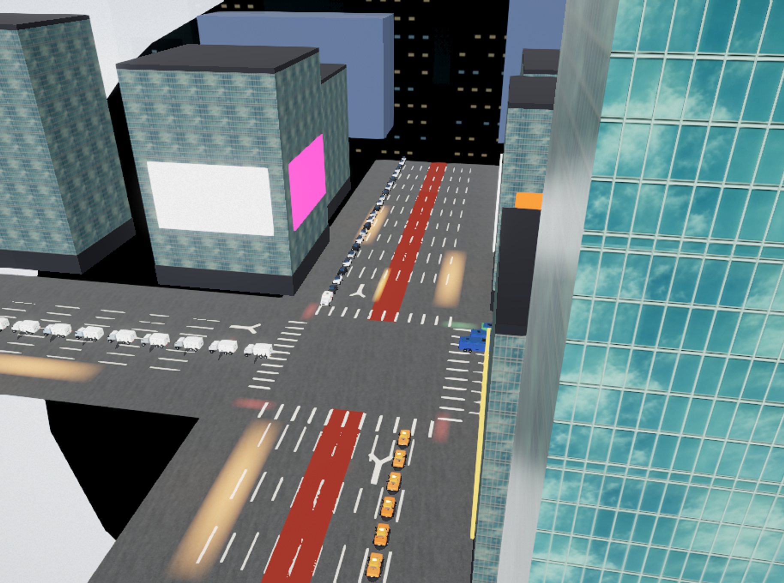
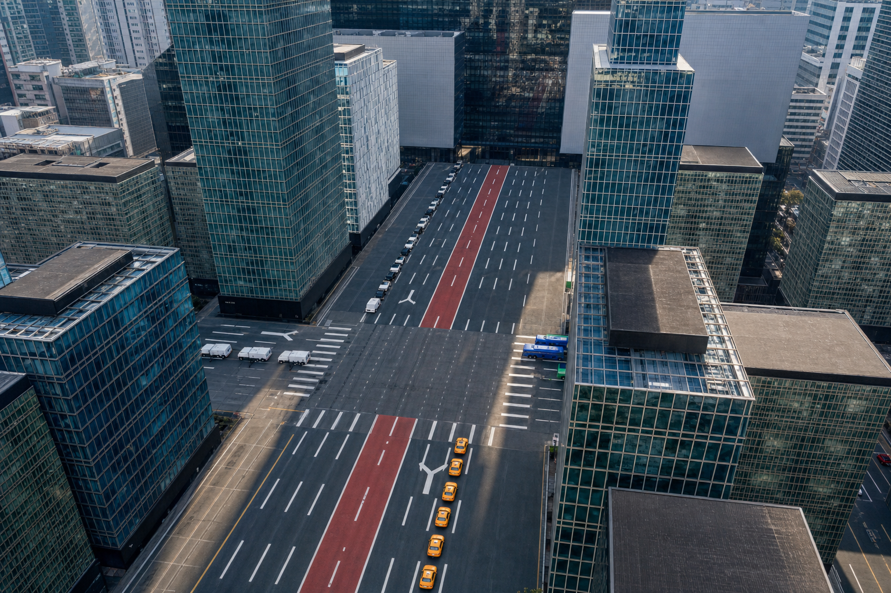
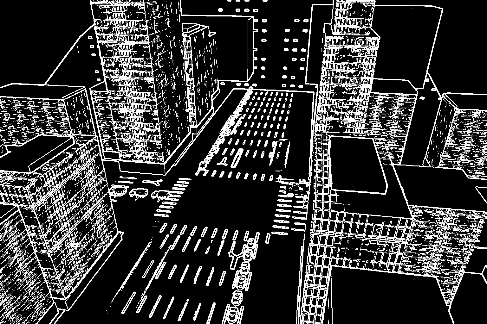
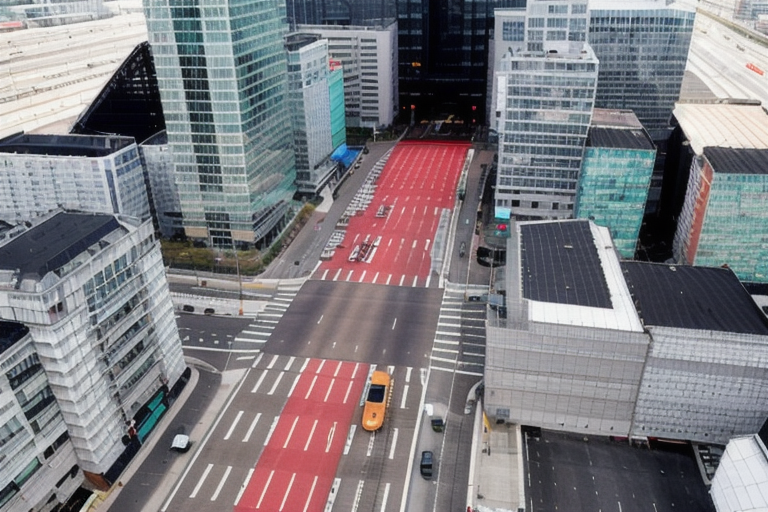
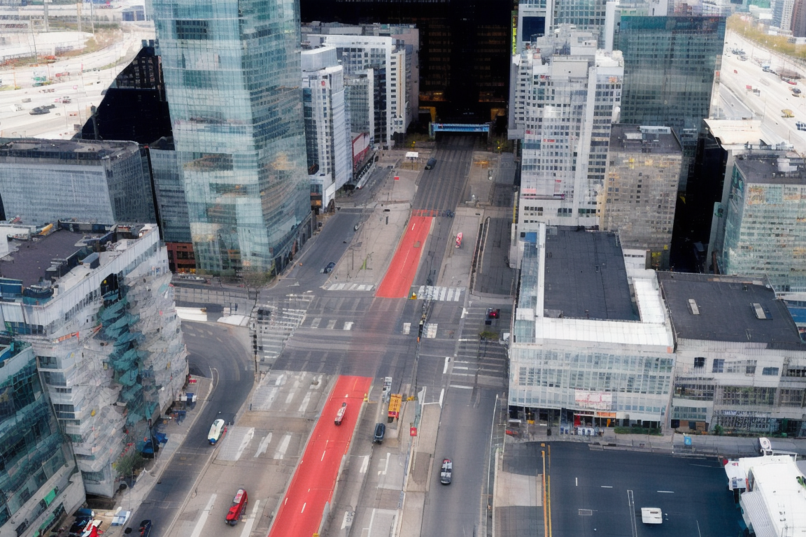
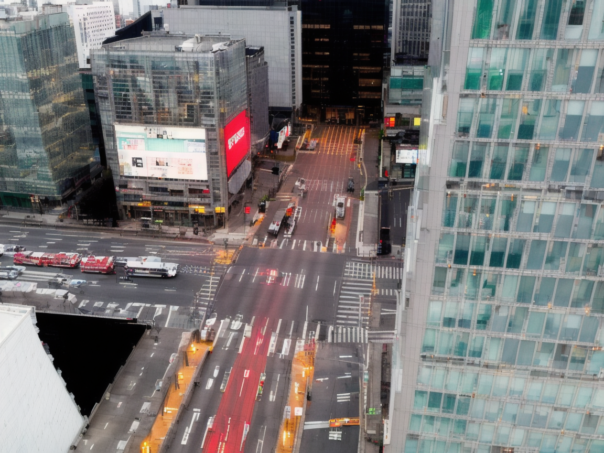
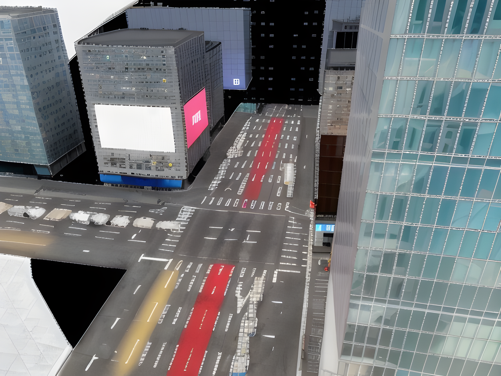
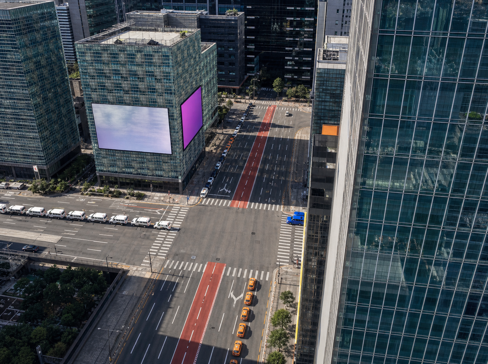
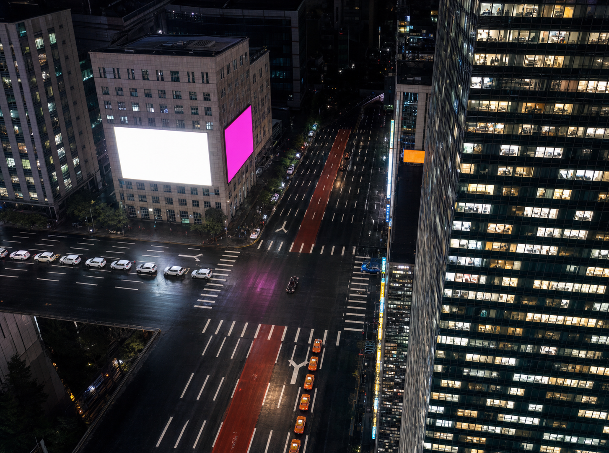

# 강남역 Photoreal — Structure-Preserving Generation Pipeline

Evidence note for the 2026-06-29 work that took the **metric 3D 강남역 사거리 scene** and produced
**photorealistic 강남역 frames while preserving the metric structure** (road, central bus lane, building
positions, vehicles on lanes). Two generation paths were built and compared; a scene/architecture direction
was set. Branch `feat/r3f-signal-grounding-cctv`.

> Draft seed for the weekly technote — expand next week. (Setup/infra plumbing intentionally omitted.)

## Goal

The dashboard must show 강남역 **photorealistically** AND keep vehicles **metrically on their lanes**. A soft
AI background plate can't do both (non-metric). The approach here: drive photorealism **from** the metric 3D
render so structure is preserved — render the metric scene → feed it to an image model that keeps the layout
and only changes the *look*.

## What we did

### 1. Metric structure source (the 3D scene)
The metric R3F 강남역 scene (faithful asymmetric skyline — SW 삼성타운 cluster, GT Tower, mid-rise commercial
corners with LED billboards, 테헤란로 towers receding east; commit `eac80af`) is rendered as the **structure
source**. Everything downstream preserves this layout.

*`reference` — metric 3D scene render used as the structure source (operator-wide, day).*

### 2. Two structure-preserving photoreal paths

**(A) Built-in imagegen img2img.** The metric render is transformed to a photoreal 강남역 photo, instructed to
preserve camera, road, red median bus lane, building positions, and vehicle placement.

*`exploratory` — first imagegen img2img test (earlier generic structure): photoreal + layout largely preserved.*

**(B) Local ComfyUI — SD1.5 + Canny ControlNet (img2img), on the workstation GPU.** A Canny/edge map is
precomputed from the structure (Sobel), then SD1.5 (Realistic Vision) + canny ControlNet re-textures the scene
photorealistically while the edges lock the layout. Hires-fix and an ESRGAN upscale pass were added for sharpness.

*`diagnostic` — precomputed Sobel edge map (ControlNet canny conditioning): buildings, road, lanes, crosswalks, vehicle outlines.*

*`exploratory` — ComfyUI SD1.5 + canny, first pass (768×512). Structure locked (red busway/road/buildings), soft.*

*`exploratory` — hires-fix (1152×768): crisper buildings/road/crosswalks, structure preserved.*

*`proof` — ComfyUI on the faithful 강남역 structure: asymmetric skyline + red busway read as 강남대로.*

*`exploratory` — strong-canny + low-denoise + ESRGAN: straight road + sharp, but more CG (the denoise trade-off).*

### 3. Comparison and decision
Run on the SAME faithful structure, **imagegen was clearly more photorealistic** and avoided the SD1.5 issues
(road wobble, CG look, blank facade), while preserving the layout and keeping the road straight.

*`proof` — imagegen on the faithful structure (day): glass towers, LED billboards, red median bus lane, straight road.*

*`proof` — imagegen (night): lit windows, glowing LED signage, head/tail lights, wet asphalt — 강남대로 night.*

**Decision:** use **imagegen** for the photoreal look (quality leader); keep **ComfyUI + ControlNet** as the
free / local / unlimited / tighter-structure-lock alternative (set up and working on the GPU).

### 4. Architecture direction (the key call)
The city/background is **fixed**; only **vehicles move**. So:
- **Fixed photoreal background** = imagegen photo-realization of the metric scene with an **empty road**,
  generated once (no per-frame cost). Because it is derived from the metric render, its road/building positions
  align — unlike the old from-scratch AI plate.
- **Live vehicles** = the R3F metric vehicle layer rendered **on top**, same camera → on-lane by construction.

## Findings
- **ControlNet denoise trade-off:** high denoise = photoreal but wavy road; low denoise + strong canny = straight
  but CG. Canny (edges) alone doesn't enforce road *flatness* — depth conditioning or imagegen avoids this.
- **Structure quality propagates:** a blank/featureless building face in the 3D source becomes a blank wall in
  the output; turn-arrow markings and missing signals in the source show up missing in the result.
- imagegen img2img on a *detailed* structure preserves layout far better than on a sparse structural guide.

## In progress / next
- Scene overhaul for traffic-monitoring fidelity: high steep-oblique (~70°) camera so traffic is unoccluded,
  3D traffic signals with live state, fill the blank corner building, realistic turn arrows.
- Road realism from Korean road-marking reference (중앙선 yellow, 정지선 stop lines, lane lines, 중앙버스전용 blue
  lines) + 강남대로 layout.
- Then: generate the empty photoreal background from the improved scene and composite live R3F vehicles on top.
